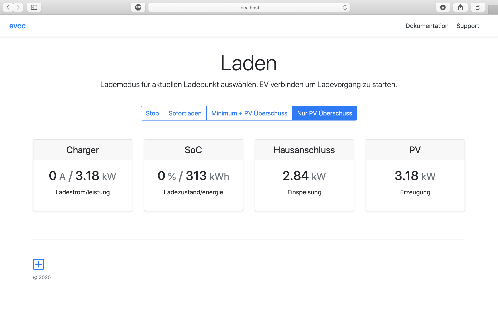

# evcc
EV Charge Controller - this is an experiment, don't expect anything

## Why EVCC?

EVCC is heavily inspired by [OpenWB](1). However, I found OpenWB's architecture slightly intimidating with everything basically global state and heavily relying on shell scripting. On the other side, especially the scripting aspect is one that contributes to [OpenWB's](1) flexibility.

Hence, for a simplified and stricter implementation of an EV charge controller, the design goals for EVCC were:

- typed language with ability for systematic testing - achieved by using [Go](2)
- structured cnofiguration - supports YAML-based [config file](evcc.dist.yaml)
- avoidance of feature bloat, simple and clean UI - utilizes [Bootstrap](3)
- integration with home automation - supports shell scripts and MQTT
- containerized operation beyond Raspbery Pi - provide multi-arch [Docker Image](4)
- support for multiple load points - tbd

[1]: https://github.com/snaptec/openWB
[2]: https://golang.org
[3]: https://getbootstrap.org
[4]: https://hub.docker.com/repository/docker/andig/evcc
